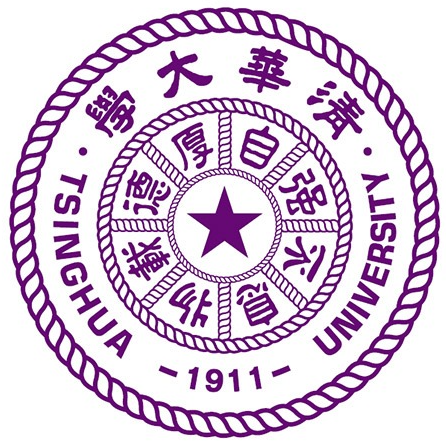
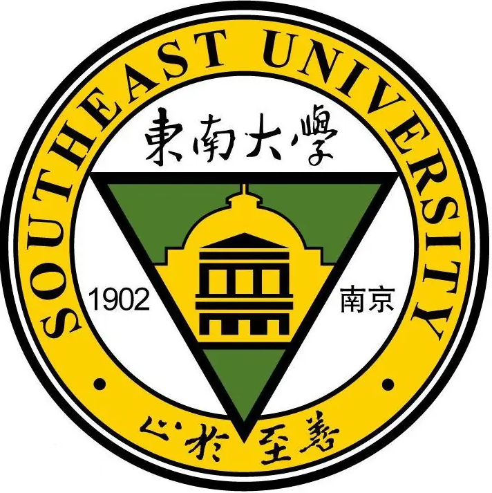



  <!-- 第一组图片和段落 -->
  

    <!-- 图片部分（1/3） -->
    

      
    

    <!-- 文字部分（2/3） -->
    

      
<strong>Tsinghua University</strong> 
      2023.9 -  
      Pursuing M.S. degree in BHE 
      

    

  

  <!-- 第三组图片和段落 -->
  

    <!-- 图片部分（1/3） -->
    

      
    

    <!-- 文字部分（2/3） -->
    

      
<strong>Southeast University</strong> 
      2019.9 - 2023.6 
      Chien-Shiung Wu College (Honors College) 
      B.S. degree in BME 
    

    

  

